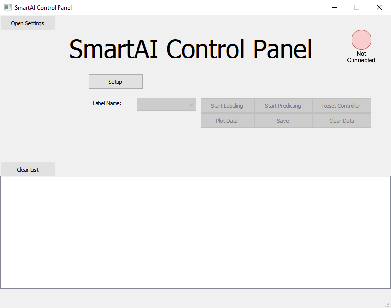
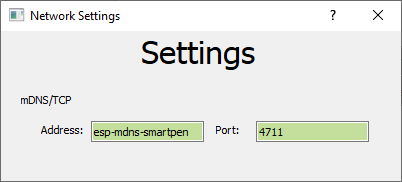
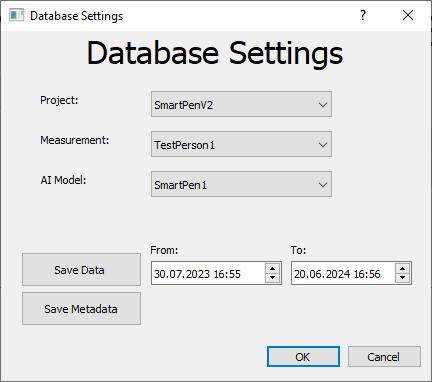
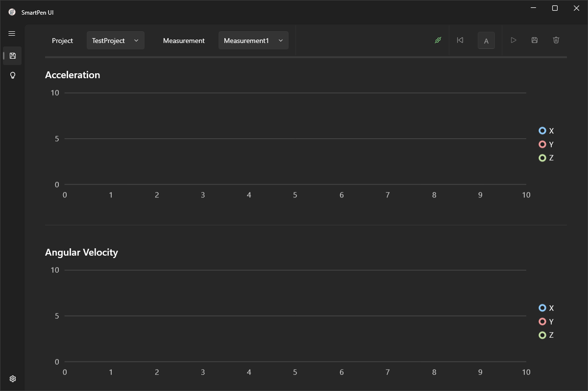
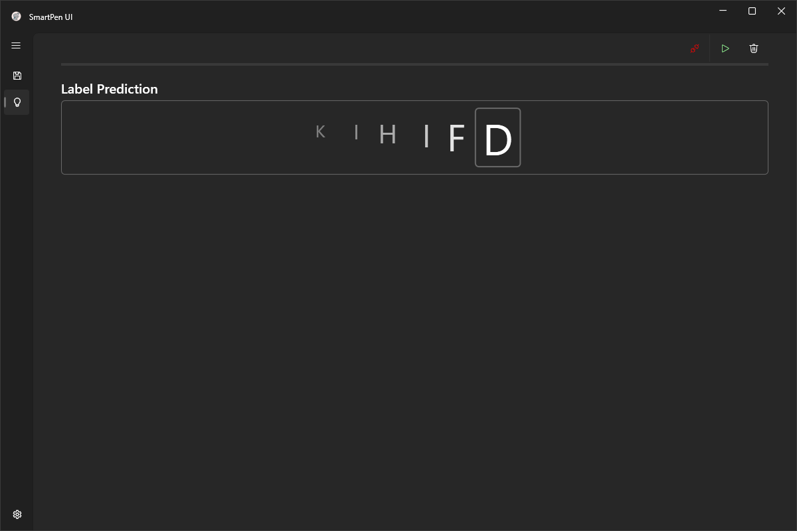
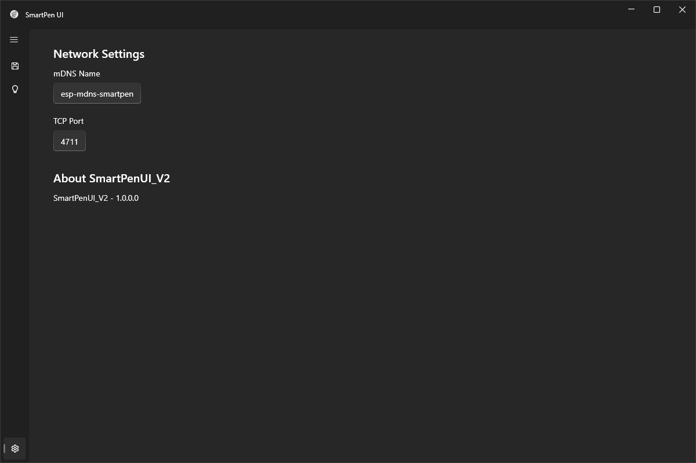

# SmartPen UI V2
Die Aufgabenstellung für dieses Projekt ist es, die alte SmartPen UI mit ihren Funktionalitäten in C# (WPF) zu implementieren und visuell verbessern.

Um die beiden GUIs gegenüber zu stellen werden hier jeweils kurz Screenshots der alten und neuen Version gezeigt.

## Gegenüberstellung
### SmartPen UI V1
#### Home Screen

#### Settings

#### Database Settings

### SmartPen UI V2
Bei der neuen Implementierung werden Labeling und Prediction über Navigation-Reiter getrennt und die notwendigen Settings, Controls und Comboboxen jeweils aufgeteilt.
#### Labeling Page

#### Prediction Page

#### Settings Page

## Verwendete Resourcen für die Implementierung
Wichtig ist es für die Implementierung anzumerken, dass für die Ausarbeitung des gesamten Projekts der GitHub-Copilot verwendet wurde.

Das Package WPF-UI wurde als UI-Theme hierfür gewählt. Als Basis für diese App wurde das WPF-UI Example für Mvvm genommen, auf dem aufgebaut und welches adaptiert und erweitert wurde.

## Verwendete Packages
- WPF-UI: GUI-Theme Package (https://github.com/lepoco/wpfui)
  - WPF-UI.Tray wird ebenfalls benötigt.
- LiveCharts2 (LiveChartsCore.SkiaSharpView.WPF): Darstellung der Sensordaten in Charts; Version 2.0.0-rc2 (prerelease) (https://github.com/beto-rodriguez/LiveCharts2)
  - SkiaSharp (Wird mit LiveCharts mitinstalliert, damit es allerdings richtig funktioniert, muss auf die Version 2.88.6 downgegradet werden!)
- CommunityToolkit.Mvvm: Für eine einfache Implementierung des Mvvm Patterns.
- WpfAnalyzers + Microsoft.Extensions.Hosting: werden für die Implementierung nicht gebraucht, sind aber im Example eingebunden gewesen und hat ohne diese nicht gestartet.

## Implementierungs- und Funktionsbeschreibung
Als Basis worauf dieses Projekt aufbaut wurde das Beispiel-Programm der WPF-UI GitHub-Seite für Mvvm verwendet. Davon wurden Teile der MainView (NavigationView und Tray Icons und Settings; also quasi der Basisaufbau der App) wiederverwendet. Diese App verwendet das Dependency Injection Prinzip für die Darstellung der Pages (für den Content der App) und Services (wie hier ein TCP-Service oder InfluxDB-Service). Davon wurde ebenfalls der Code übernommen (bis auf die nicht verwendeten Pages und Services). 

Für die adaptive Anzeige der Buttons (Farben und Icons) wurden Converter implementiert, welche hier allerdings nicht genauer beschrieben, da diese nicht besonders relevant sind.

### Services
#### Dummy TCP-Client Service
Um das Verhalten eines Beispiel TCP-Clients, wie er auch bei der alten Version besteht, emulieren zu können wurde ein Dummy erstellt. Dieser enthält die grundlegende Funktionalität eines TCP-Clients und kann mittels einfacher Funktionen zufällige Werte generieren. Für die Präsentation wird zusätzlich ein einfacher TCP-Server erstellt, womit sich dieser Client verbinden kann, um die Übertragung und Darstellung der Daten von einem Server vorzeigen zu können.

#### Dummy InfluxDB Service
Da ich leider keinen Zugang mehr zu der InfluxDB Datenbank der Bachelorarbeit habe, wurde hier eine Dummy Klasse für den InfluxDB-Service erstellt. Dieser kann bei bedarf mit Funktionalität befüllt werden. Hier macht er allerdings nichts.

#### Snackbar Service
Um das Chat-Feld der alten Version der GUI zu ersetzten wurde eine Snackbar hinzugefügt. Diese benötigt einen SnackbarPresenter in der MainView, sowie einen Service. Beides wird bereits vom WPF-UI Package zu Verfügung gestellt und kann über die Show()-Funktion des Services aufgerufen werden.

### DataLabelingPage/ViewModel
#### Page Aufbau
Der obere Teil der Page wird mittels eines 'Menu's gelöst. Es enthält (von links nach rechts) 2 Comboboxen, sowie einige Buttons zur Steuerung der App, TCP-Connection und Datenlabeling. Über die erste Combobox wird eingestellt, unter welchem Projekt die Daten in der Datenbank abgespeichert werden. Die 2. Combobox wählt aus, welcher Datensatz gerade aufgenommen wird (enthält meistens den Namen der Person, welche die Daten gerade aufnimmt). Die Daten für diese Comboboxen kommen aus dem DummyInfluxDB-Service und werden in das Viewmodel eingebunden, um diese als ItemSource für die Boxen verwenden zu können.

Der erste Button ist der Connect/Disconnect Knopf für die TCP-Verbindung. Hiermit wird die Connect/Disconnect-Funktion des DummyTCPClient-Service aufgerufen und damit die Verbindung zum Server hergestellt oder getrennt.

Hiernach ist ein Button und eine TextBox zur Steuerung des aktuellen Labels zu erkennen. In der Textbox wird das gerade ausgewählte Label für die Datenaufnahme angezeigt. Der Button links daneben dient dazu das Label um eins zurückzuschalten. Dies kann helfen, falls man nach dem Speichern der Daten merkt, dass diese nicht korrekt waren. 

Danach kommt der Start/Stop Labeling Button. Dieser startet/stoppt die Aufnahme der Daten vom Server. Dieser Button verwendet ebenso den DummyTCP-Service, um den Start/Stop Befehl an den Server weiterzuleiten.

Der vorletzte Knopf ist der Save-Button. Dieser speichert die aktuelle gesammelten Daten, welche im Model gehalten werden, zur Datenbank und stellt das aktuelle Label um eins weiter.

Der letzte ist der Scrap-Button. Bemerkt man nach dem Stoppen der Aufnahme der Daten, dass diese falsch sind, können sie mit diesem Knopf wieder gelöscht werden. Hier wird das aktuelle Label nicht inkrementiert.

Darunter werden die gesammelten Daten vom Server mittels 3 CartesianCharts (von LiveChartsCore) dargestellt. Im ersten Diagramm wird die Beschleunigung, im zweiten die Winkelgeschwindigkeit und im dritten der Druck aus dem Drucksensor dargestellt. Beschleunigung und Winkelgeschwindigkeit werden für alle 3 Achsen X, Y und Z aufgenommen.

#### ViewModel
Das Viewmodel beschreibt alle nötigen Commands für die View und verwaltet alle nötigen bool Flags für die Aktivierung und Deaktivierung der Buttons. Außerdem werden die beiden notwendigen Services und deren Properties für die Darstellung initialisiert/"durchgeschleust".

#### Model
Da die Daten in dieser App, welche direkt vom dem TCP-Server kommen, direkt in der View angezeigt werden, ohne irgendeine Manipulation der Daten(oder business logic), habe ich mich dazu entschlossen, kein Model hier einzusetzen. Außerdem werden ebenso in der Example-App Models lediglich zur Definition von Data-Klassen verwendet. 

### PredictionPage/Viewmodel/Model
#### Page Aufbau
Der obere Teil der Page wird wie auch bei der DataLabelingPage mittels eines 'Menu's gelöst. Es enthält diesmal allerdings nur die notwendigen Buttons zur Steuerung der TCP-Connection und Prediction.

Der erste Button ist der Connect/Disconnect Knopf für die TCP-Verbindung. Hiermit wird die Connect/Disconnect-Funktion des DummyTCPClient-Service aufgerufen und damit die Verbindung zum Server hergestellt oder getrennt.

Danach kommt nun der Start/Stop Predicting Button. Dieser startet/stoppt die Aufnahme der Daten auf dem Server-Gerät (wird nicht an die App gesendet). Wird die Aufnahme gestoppt, wird nach kurzer Zeit vom Server das erkannte Label zurückgesendet. Dieser Button verwendet ebenso den DummyTCP-Service, um den Start/Stop Befehl an den Server weiterzuleiten.

Darunter werden nun nichtmehr die Daten der Sensoren, sondern das erkannte Label dargestellt. Um ebenso vergangene Labels (die letzen 6 inkl. dem neuesten werden gezeigt) noch im Blick zu haben, werden diese nebeneinander (kleiner und durchsichtiger werdend) dargestellt.

Der letzte ist der Scrap-Button. Hierbei wird die Liste an erkannten Labels gelöscht.

#### ViewModel
Das Viewmodel beschreibt alle nötigen Commands für die View und verwaltet alle nötigen bool Flags für die Aktivierung und Deaktivierung der Buttons. Außerdem wird der notwendige Service geholt (GetService) und gehalten.

#### Model
Da die Daten in dieser App, welche direkt vom dem TCP-Server kommen, direkt in der View angezeigt werden, ohne irgendeine Manipulation der Daten(oder business logic), habe ich mich dazu entschlossen, kein Model hier einzusetzen. Außerdem werden ebenso in der Example-App Models lediglich zur Definition von Data-Klassen verwendet. 